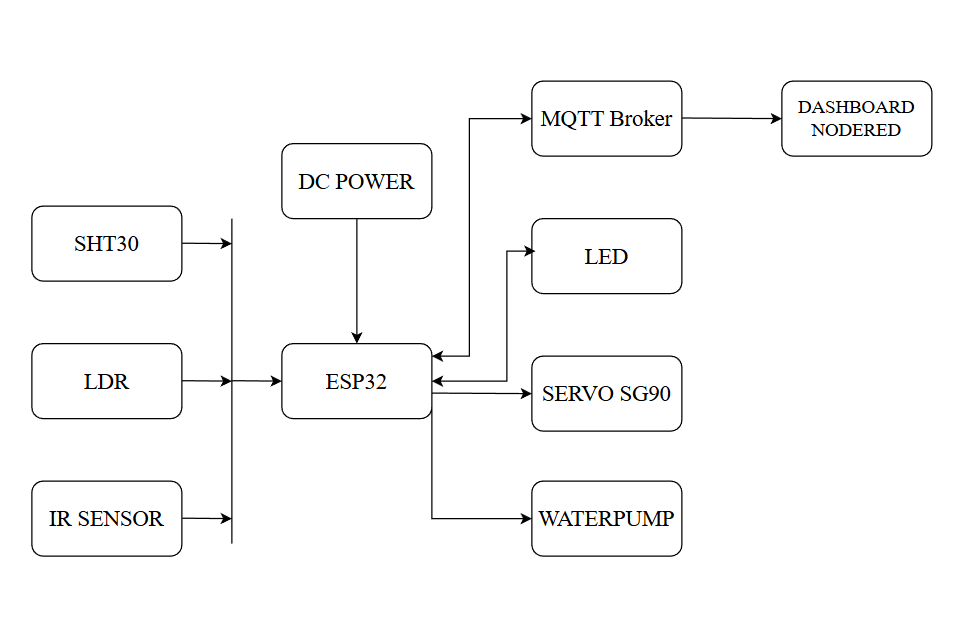
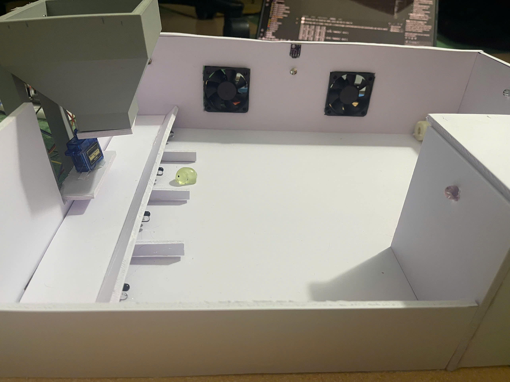
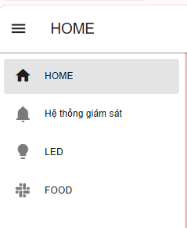
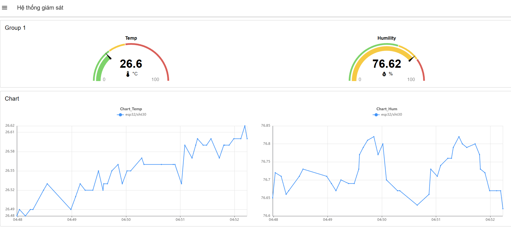
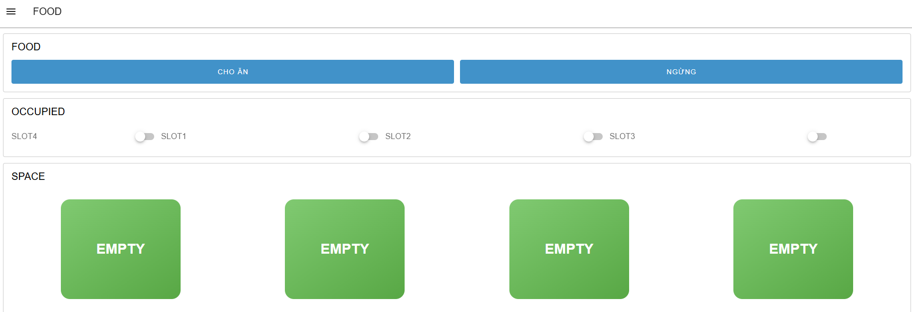

#  SMART PET CARE SYSTEM – HỆ THỐNG CHĂM SÓC THÚ CƯNG THÔNG MINH

##  Mô tả đề tài
Trong cuộc sống hiện đại, thú cưng ngày càng được xem là một thành viên trong gia đình. Tuy nhiên, việc chăm sóc chúng đòi hỏi nhiều thời gian: cho ăn đúng giờ, theo dõi môi trường sống, đảm bảo an toàn…  
Hệ thống chăm sóc thú cưng thông minh được xây dựng nhằm giải quyết các vấn đề này thông qua IoT, cảm biến và điều khiển tự động.

---

##  Mục lục
- 1. Problem Statement  
- 2. Main Content  
- 3. Block Diagram  
- 4. Pin Diagram  
- 5. Results  
- 6. Conclusion  

---

# 1. Problem Statement

###  Nhu cầu thực tế
- Chủ bận rộn → quên cho ăn hoặc thay nước.  
- Không thể theo dõi thú cưng khi đi làm hoặc đi xa.  
- Môi trường sống thay đổi (nhiệt độ, độ ẩm, khí gas) → gây nguy hiểm.  
- Không biết thú cưng đang có trong chuồng hay đã đi ra ngoài.

###  Nguồn cảm hứng
- Nhiều thú cưng gặp nguy hiểm do môi trường sống không đảm bảo.  
- Mong muốn tạo ra một hệ thống giá rẻ, dễ triển khai.

---

# 2. Main Content

##  2.1. Hardware
- ESP32 DevKit V1  
- 4 × IR Sensor  
- 1 × Servo SG90  
- 1 × SHT30  
- 1 × LDR light sensor  
- Quạt mini  
- Đèn LED  
- Máy bơm mini 5V

##  2.2. Software
- Node-RED Dashboard  
- MQTT Broker (EMQX)  
- PlatformIO (Arduino C++)  

##  2.3. Concept
- Giám sát vị trí thú cưng theo thời gian thực  
- Cho ăn tự động bằng servo  
- Theo dõi môi trường liên tục  
- Điều khiển quạt và đèn theo ngưỡng hoặc thủ công  

---

# 3. Block Diagram  

---

# 4. Pin Diagram

| Thiết bị | Chân | ESP32 |
|---------|------|--------|
| Servo | PWM | 16 |
| IR Sensor 1 | OUT | 36 |
| IR Sensor 2 | OUT | 39 |
| IR Sensor 3 | OUT | 34 |
| IR Sensor 4 | OUT | 35 |
| SHT30 | SDA/SCL | 21 / 22 |
| MQ-2 | AOUT | 32 |
| LDR | AOUT | 33 |
| LED1 | OUT | 23 |
| LED2| OUT | 19 |
| LED3 | OUT | 18 |
| LED4 | OUT | 5 |
| Fan | OUT | 14 |

---

# 5. Results

## 5.1. Mô hình

## 5.2. Node-RED Dashboard

- Node-red dashboard bao gồm 5 trang: Home, Hệ thống giám sát, LED, FOOD 

  

 
- Hình dưới minh họa giao diện Node-RED Dashboard của hệ thống.
Hai đồng hồ phía trên hiển thị nhiệt độ và độ ẩm hiện tại theo thời gian thực.
Bên dưới là hai biểu đồ đường thể hiện lịch sử thay đổi nhiệt độ và độ ẩm, giúp theo dõi xu hướng môi trường trong chuồng thú cưng một cách trực quan.
  
- Giao diện FOOD

Giao diện được chia thành 2 phần :
Khu vực cho ăn: Hai nút “Cho ăn” và “Ngừng” dễ thao tác.
Khu vực Occupied: Các công tắc hiển thị trạng thái từng slot
  

---

# 6. Conclusion
- Theo dõi thú cưng theo thời gian thực  
- Tự động cho ăn  
- Giám sát môi trường đầy đủ  
- Điều khiển thiết bị theo ngưỡng hoặc thủ công  
- Dashboard dễ dùng và trực quan  
- Kết nối MQTT ổn định  

## Hướng phát triển:
- Camera livestream  
- Nhận diện thú cưng bằng AI  s
- Lịch cho ăn tự động  
- Cảnh báo qua Zalo / Telegram  

**Video Demo:** [**SYSTEM_PET**](https://youtu.be/x6xEZpHiuJ8?si=lCuMXzhCYWD90C8O)
